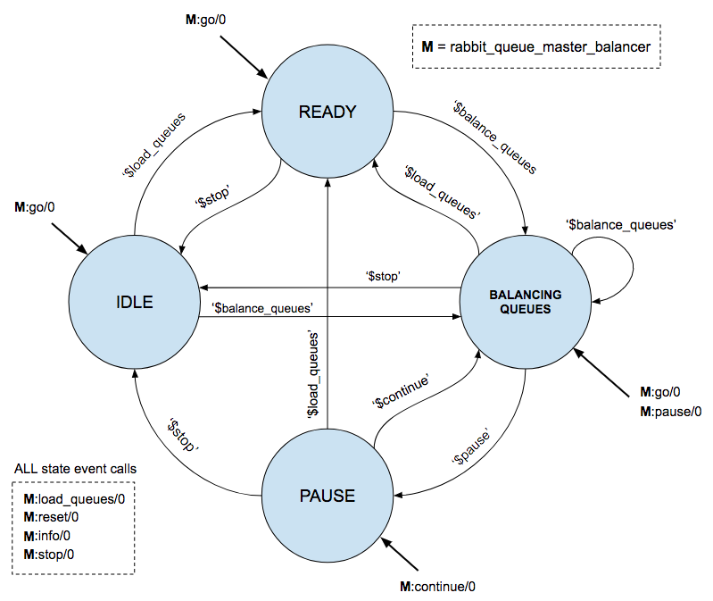

## RabbitMQ Queue Master Balancer

RabbitMQ Queue Master Balancer is a tool used for attaining queue master equilibrium across a RabbitMQ cluster installation. The plugin achieves this by computing queue master counts on nodes and engaging in shuffling procedures, with the ultimate goal of evenly distributing `queue masters` across RabbitMQ cluster nodes. Internally, the tool comprises of an FSM engine which transitions between different states of operation, to allow the procedures to be carried in a fully controllable manner.

**NOTE:** This plugin is still experimental and yet to mature. We strictly recommend usage for RabbitMQ support operations only, at planned and scheduled time periods when the cluster nodes are under minimal, or most preferrably, zero traffic load.

## Design

The following diagram depicts the underlying design and operational concepts of the Queue Master Balancer FSM engine.



As illustrated, the plugin is at any time in it's operation in one of 4 states, which are:

- **IDLE:** In this state, the plugin is at rest and carries out no actions while awaiting to be triggered into READY or BALANCING QUEUES states depending on the received event, which are `$load_queues` or `$balance_queues` event.
- **READY:** The plugin engages the READY state whenever it is loaded with queues. The `$load_queues` event will cause the plugin to acquire all queues in preparation for balancing them out in the cluster, thus entering the READY state.
- **BALANCING QUEUES:** This is the state in which the plugin is "working", i.e. moving queues around the cluster to achieve queue equilibrium. The `$balance_queues` event will bring the plugin into this state, depending on its previous state. 
- **PAUSE:** While in BALANCING QUEUES state, the plugin may be paused by triggering the `$pause` event. Once in PAUSE state, the plugin retains the current pending queues still to be balanced, and awaits reception of `$continue` event to proceed in balancing them out. This `$continue` event takes the plugin's state back to BALANCING QUEUES.

In addition, regardless of its current state, the Queue Master Balancer plugin is always receptive to `$load_queues`, `$stop` and `$reset` events. Details on events and their execution are discussed in **Operation** section.


## Supported RabbitMQ Versions

This plugin is compatible with RabbitMQ 3.6.x and beyond.


## Installation

### Packaging

Download pre-compiled versions from [https://github.com/Ayanda-D/rabbitmq-queue-master-balancer/releases](https://github.com/Ayanda-D/rabbitmq-queue-master-balancer/releases)

### Build

Clone and build the plugin by executing `make`. To create a package, execute `make dist` and find the `.ez` package file in the `plugins` directory.

## Configuration

The Queue Master Balancer may be configured in the `rabbitmq.config` file as follows:

```
[{rabbitmq_queue_master_balancer,
     [{operational_priority, 5},
      {preload_queues,       false},
      {sync_delay_timeout,   3000},
      {inter_policy_delay,   10}]
 }].

```

The following table summarizes the meaning of these configuration parameters.


| PARAMETER NAME  | DESCRIPTION  | TYPE  |  DEFAULT | 
|---|---|---|---|
| operational\_priority  | Priority level the plugin will use to balance queues across the cluster. This should be higher than the highest configured policy priority | Integer | 5 |  
| preload\_queues | Determines whether queues are automatically loaded on plugin start-up before the balancing operation is started | Boolean | false |
| sync\_delay_timeout | Time period (in milliseconds) the plugin should wait for slave queues to synchronize to the master queue before the balancing procedure is completed  | Integer | 3000 |
| inter\_policy_delay | Time period (in milliseconds) the plugin should wait while changing/transitioning from one policy to another. The plugin undergoes `4` transitions when balancing a queue | Integer | 50  |


## Operation

For RabbitMQ versions 3.6.x, the plugin is operated and executed using the traditional and classic `rabbitmq-plugins` and `rabbitmqctl eval` command line interfaces. Supported operations are as follows:

### 1. Enable plugin
 
The plugin is enabled like any other standard [RabbitMQ plugin](https://www.rabbitmq.com/plugins.html).
 
`rabbitmq-plugins enable rabbitmq_queue_master_balancer`

### 2. Get plugin information
 
The plugin may be queried for it's current state information at any point of it's operation. This is carried out by executing the `info` call:

`rabbitmqctl eval 'rabbit_queue_master_balancer:info().'`

### 3. Load queues

Once enabled, the plugin must be loaded with queues which it's going to balance across the cluster. If the `preload_queues` configuration parameter is set to `true` in the `rabbitmq.config` file, this procedure may not be necessary. However, queues may still be loaded as follows regardless of the plugin's configuration: 
 
`rabbitmqctl eval 'rabbit_queue_master_balancer:load_queues().'`

### 4. Balance loaded queues 

Once queues have been loaded, the balancing procedures may then be executed by issuing the `go` command as follows:

`rabbitmqctl eval 'rabbit_queue_master_balancer:go().'`

### 5. Pause balancing

While queues are undergoing balancing, the plugin may be `paused`, at which point it switches into its PAUSE state, retaining the queues pending balance up until that point in time. The following command is executed to trigger the plugin's PAUSE state:

`rabbitmqctl eval 'rabbit_queue_master_balancer:pause().'`

### 6. Continue balancing

To proceed back into BALANCING QUEUES from the PAUSE state, the `continue` command is executed as follows:

`rabbitmqctl eval 'rabbit_queue_master_balancer:continue().'`

### 7. Reset plugin

The plugin may be reset at any point in time, setting it back to its IDLE state and in the following manner.

`rabbitmqctl eval 'rabbit_queue_master_balancer:reset().`

### 8. Stop plugin

In context of the plugin, stopping is similar to `reset`, in that it is set back to IDLE. The different being the state variables are maintained, and the plugin may still be queried for its last information:

`rabbitmqctl eval 'rabbit_queue_master_balancer:stop().'`

### 9. Disable plugin

The plugin is disabled as follows:

`rabbitmq-plugins disable rabbitmq_queue_master_balancer`

## Additional information

The following aspects must be put into consideration when putting it to use:

 - Queue balancing is a delicate operation which **must** be carried out in a very controlled manner and environment not prone to network partitions. Ensure your network is in a stable condition prior to executing queue balancing procedures.
 - Configuration parameters such as `inter_policy_delay` need to be bumped up as aspects such as cluster size, queue slave count and message size increase.
 - The distribution of Queues within a cluster is non-deterministic and a single execution round of the Queue Master Balancer may not be enough to attain immediate equilibria. The plugin may (or may not) need multiple execution rounds before satisfactory queue equilibrium is attained.

## License and Copyright

(c) Erlang Solutions Ltd. 2017-2018

https://www.erlang-solutions.com/
